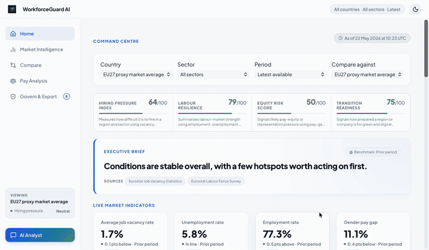
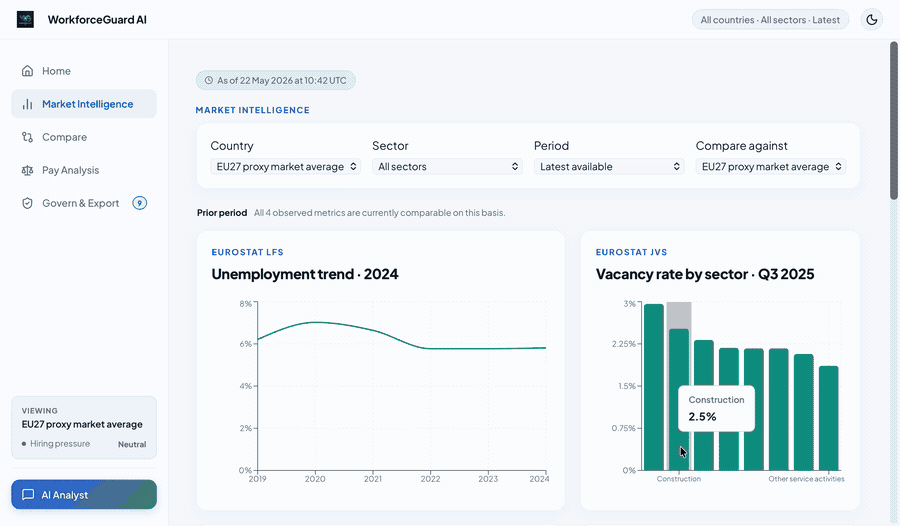
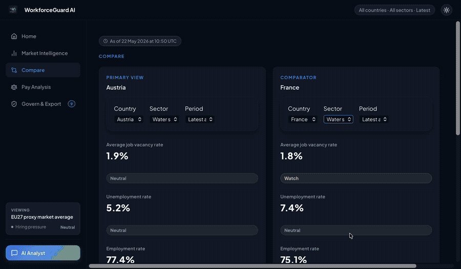
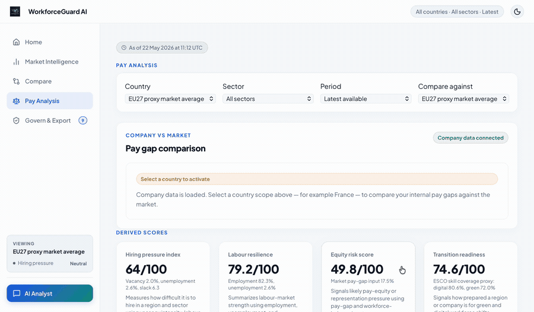
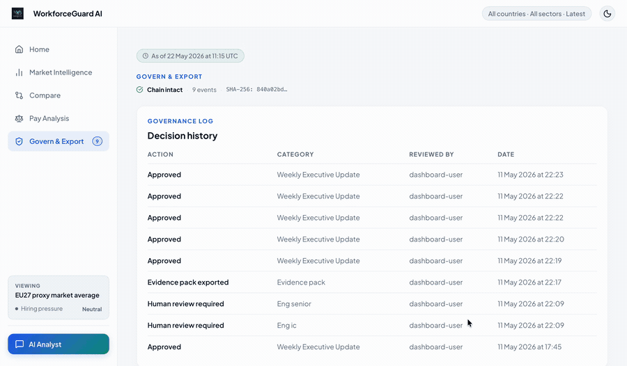
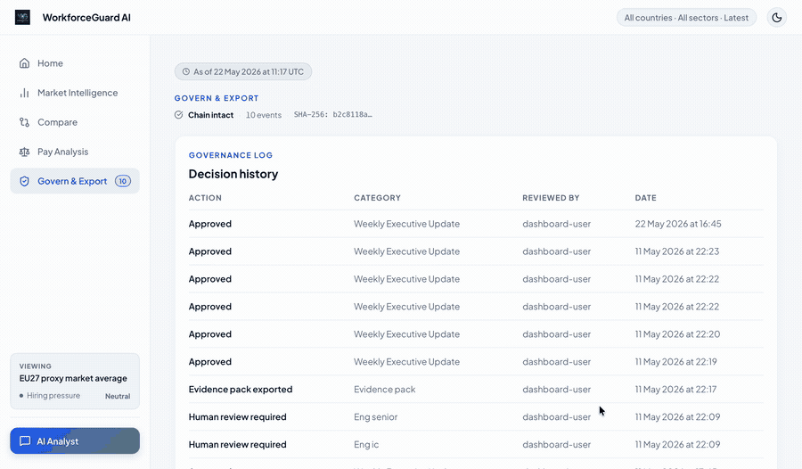

# WorkforceGuard AI

**EU workforce intelligence and pay-transparency compliance platform for HR, people analytics, and strategy teams.**
## Research Paper

This system is described in:

> Vamseekar, M.S. (2026). *Why Tight Labour Markets Do Not Close Gender 
> Pay Gaps: Evidence from a 20-Country Eurostat Panel.*  
> Independent Researcher. May 2026.  
> SSRN: [under review] | MPRA: [under review] | Zenodo: [under review]

**Live dashboard:** https://workforceguard-ai.vercel.app  
**Keywords:** gender pay gap · pay transparency · EU Pay Transparency Directive · 
labour market tightness · Eurostat · composite indicators

---
Live at → **[workforceguard-ai.vercel.app](https://workforceguard-ai.vercel.app)**

---

## Demo

| | |
|---|---|
| **Command Centre** — signal scores, executive brief, live market indicators | **Market Intelligence** — unemployment trend, vacancy by sector, gender pay gap charts |
|  |  |
| **Compare** — side-by-side country and sector benchmarking | **Pay Analysis** — company vs market pay gap with derived scores |
|  |  |
| **Govern & Export** — hash-chained audit log and compliance evidence pack | **AI Analyst** — natural language questions with grounded evidence |
|  |  |

---

## What it does

WorkforceGuard turns public EU labour-market data and internal company payroll into decision-ready intelligence — with a full compliance audit trail built in.

- **Labour market dashboard** — employment rate, unemployment, job vacancies, and gender pay gap across all 27 EU member states and 13 NACE sectors, sourced directly from Eurostat
- **Benchmark-aware analyst** — ask natural-language questions; the copilot answers with grounded evidence, provenance citations, and benchmark context (prior period, EU average, or peer group)
- **Country × sector comparison** — side-by-side delta table with auto-generated narrative synthesis across any two geographies or sectors
- **Pay transparency review** — upload internal payroll; the platform blends it against market benchmarks and surfaces review items flagged under the EU Pay Transparency Directive
- **Governance and audit log** — every decision (approve, override, reverse, export) is written to a SQLite-backed hash-chained event log for legal-grade evidence packs
- **Compliance evidence pack** — one-click export of all metrics, provenance, and governance events as a structured bundle ready for regulatory filing

---

## EU regulatory context

The [EU Pay Transparency Directive](https://eur-lex.europa.eu/legal-content/EN/TXT/?uri=CELEX%3A32023L0970) (2023/970) requires employers to report and justify pay differences by May 2026. CSRD and Article 9 SFDR impose parallel workforce disclosure obligations. WorkforceGuard is designed specifically for this compliance surface — not generic HR analytics.

---

## Architecture

```
Eurostat API  ──►  Python ingestion  ──►  DuckDB  ──►  dbt models
                                                           │
                    Internal payroll (CSV/upload) ─────────┘
                                                           │
                                                     FastAPI service
                                                           │
                                              React + Vite dashboard
```

**Data layer:** Eurostat LFS, JVS, and SES ingested as Parquet → staged and modeled in dbt (staging → core marts → internal marts → public company benchmarks) → served via DuckDB at query time, no database server required.

**API layer:** FastAPI with a single `AnalyticsRepository` that resolves filters, computes metrics, assembles evidence bundles, and writes governance events. Deployed on GCP via Docker.

**Frontend:** React 18 + TypeScript + Vite, TanStack Query for data fetching, Recharts for time-series visualisation, Tailwind CSS. Deployed on Vercel.

**CI/CD:** GitHub Actions — push to `main` triggers parallel deploy to GCP (backend via SSH + Docker) and Vercel (frontend).

---

## Data sources

| Source | Dataset | Coverage |
|---|---|---|
| Eurostat Labour Force Survey | Employment rate, unemployment rate, gender pay gap | EU27, 2019–2024 |
| Eurostat Job Vacancy Statistics | Job vacancy rate by sector | EU27, quarterly |
| Eurostat Structure of Earnings Survey | Pay gap by sector and occupation | EU27 |
| EGAPro (France) | Company-level gender pay index | French listed companies |
| UK Gender Pay Gap Service | Company GPG disclosures | UK listed companies |

---

## Key engineering decisions

**Hash-chained governance log** — audit events are chained by SHA-256 so any tampering is detectable. The chain integrity status is shown in the dashboard and verified on every API call.

**Evidence provenance on every metric** — every number displayed traces back to its Eurostat source ID, dataset version, formula version, and whether human review is required. This is structural, not cosmetic.

**Benchmark-aware copilot** — the analyst endpoint selects the appropriate benchmark basis (prior period / EU average / peer group) based on data coverage, then wraps every answer with the benchmark confidence and a coverage note. It refuses to answer confidently when coverage is partial.

**dbt layered modeling** — staging → core → internal → public company mart separation means the EU reference layer and company-specific layer are independently testable and replaceable.

---

## Local setup

**Prerequisites:** Python 3.11+, Node 20+, dbt-duckdb

```bash
# Clone
git clone https://github.com/SVamseekar/workforceguardai.git
cd WorkforceGuard-AI

# Backend
pip install -r dashboard/backend/requirements.txt
cd dashboard/backend && uvicorn main:app --reload --port 8000

# Frontend (separate terminal)
cd dashboard/frontend && npm install && npm run dev
# → http://localhost:5173
```

To run the dbt models against local data:

```bash
cd analytics
dbt run
dbt test
```

---

## Stack

`Python` `FastAPI` `DuckDB` `dbt` `Parquet` `React` `TypeScript` `Vite` `TanStack Query` `Recharts` `Tailwind CSS` `Docker` `GCP` `Vercel` `GitHub Actions`
