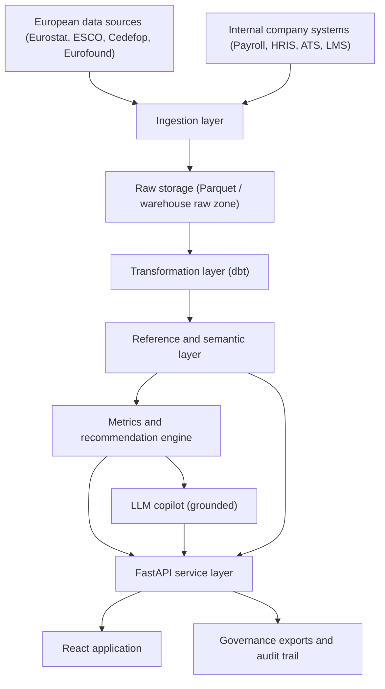

# WorkforceGuard Solution Architecture

## 1. Plain-English Summary

WorkforceGuard should become a **European Workforce Intelligence and Compliance Command Centre**.

In simple terms, that means the product should help a company answer two kinds of questions:

1. **What is happening in the European labour market?**
2. **What should our company do next, and are we staying compliant?**

This is not just a charting tool. It is a decision-support product with:
- trusted European labour data
- company-specific workforce data
- explainable metrics
- compliance simulation
- human-reviewed AI recommendations

## 2. Who The Product Is For

Primary users:
- HR Directors
- People Analytics teams
- Compensation and Benefits teams
- Workforce Planning teams
- Compliance / Legal teams

Secondary users:
- Works council / employee representative stakeholders
- Regional business leaders
- Talent acquisition leaders

## 3. What The Product Must Actually Do

### Phase 1 product value

Without internal company data, WorkforceGuard is a **European workforce market intelligence product**.

Users should be able to:
- see labour pressure by country, region, and sector
- compare regions using consistent European data
- identify hiring hotspots and talent slack
- understand pay-equity risk signals at a market level
- ask grounded questions about labour conditions

### Phase 2 product value

With internal company data connected, WorkforceGuard becomes a **workforce decision engine**.

Users should be able to:
- simulate pay-transparency exposure
- benchmark internal workforce conditions against market conditions
- identify candidate markets to investigate
- assess transition readiness for green/digital skill demand
- generate evidence-backed governance and compliance briefs

## 4. Product Scope Boundaries

The system **can** do:
- labour-market intelligence
- regional and sector comparisons
- skills and occupation mapping
- compliance simulation
- explainable recommendations

The system **must not claim** to do the following unless internal company data is connected:
- explain company-specific turnover
- calculate company-specific pay transparency exposure
- measure workforce skill gaps inside a company
- make final automated HR decisions

## 5. Architecture Principles

1. **Compliance first**
   Every important recommendation must be traceable and reviewable.

2. **Metrics before LLMs**
   Business logic belongs in modeled metrics, not inside prompts.

3. **Metadata is a product feature**
   Users and auditors must see where data came from, which version was used, and whether human review is required.

4. **Europe-first semantics**
   Regions, occupations, sectors, and skills must align with official European standards.

5. **Human oversight by design**
   Recommendations can be reviewed, overridden, and reversed.

## 6. Data Strategy

### External European data layer

This layer powers market intelligence.

Primary sources:
- Eurostat
- ESCO
- ESCO-NACE crosswalk
- Cedefop
- Eurofound

Primary use cases:
- labour demand and slack
- labour flows
- occupation and skills standardization
- sector transitions
- working conditions context

### Internal company data layer

This layer powers company-specific decisioning.

Required internal sources:
- payroll
- HRIS
- ATS / recruiting
- job architecture
- employee skills / learning systems
- turnover / mobility history

Primary use cases:
- pay transparency simulation
- internal vs market benchmarking
- workforce risk scoring
- transition readiness

## 7. Canonical Business Entities

These are the core concepts the product should model.

- `region`
  Europe, country, NUTS 2 as default, NUTS 3 when supported
- `sector`
  NACE-based economic activity
- `occupation`
  ESCO occupation
- `skill`
  ESCO skills and knowledge concepts
- `worker_category`
  Employer-defined category of workers / work of equal value
- `time_period`
  Year, quarter, or month depending on the source
- `metric_definition`
  The approved business formula for a signal
- `recommendation_event`
  A generated recommendation and its evidence
- `governance_event`
  Review, override, approval, reversal, export

## 8. Reference And Metadata Layer

Metadata must be stored as first-class data, not hidden in code.

Recommended reference tables:

- `ref_geography`
  - `geo_id`
  - `nuts_code`
  - `nuts_level`
  - `parent_nuts_code`
  - `country_code`
  - `region_name`
  - `coverage_status`

- `ref_esco_occupation`
  - `esco_uri`
  - `preferred_label`
  - `isco_code`
  - `taxonomy_version`
  - `effective_date`

- `ref_esco_skill`
  - `skill_uri`
  - `preferred_label`
  - `skill_type`
  - `taxonomy_version`

- `ref_nace`
  - `nace_code`
  - `preferred_label`
  - `nace_version`

- `ref_esco_nace_crosswalk`
  - `esco_uri`
  - `nace_code`
  - `crosswalk_version`
  - `effective_date`
  - `mapping_source`

- `ref_metric_registry`
  - `metric_id`
  - `metric_name`
  - `definition`
  - `formula_version`
  - `owner`
  - `human_review_required`

## 9. Core Fact Tables

Use multiple fact tables instead of forcing one table to carry every grain.

- `fct_labour_market_region_sector`
  Regional and sector workforce indicators from Eurostat

- `fct_labour_market_flows`
  Employment / unemployment / inactivity transitions

- `fct_occupation_skill_signals`
  Occupation and skills pressure, overlap, and transition indicators

- `fct_internal_pay_snapshot`
  Internal payroll facts for pay-transparency simulation

- `fct_internal_workforce_snapshot`
  Internal headcount, turnover, mobility, representation

- `fct_governance_events`
  Human oversight and system traceability events

## 10. Approved Metric Registry

The LLM should never invent these. They should be defined and versioned in the semantic layer.

### `hiring_pressure_index`

Purpose:
- indicate how difficult it is to hire in a region/sector/occupation

Inputs:
- vacancy rate or vacancy count
- labour market slack
- labour flow inflow/outflow

Example directional logic:
- higher vacancies
- lower slack
- weaker candidate inflow
= higher pressure

### `equity_risk_score`

Purpose:
- indicate likely pay-equity or representation pressure

Inputs:
- unadjusted pay gap
- representation skew
- promotion / mobility imbalance

### `transition_readiness`

Purpose:
- indicate whether a region, sector, or company is ready for green and digital workforce shifts

Inputs:
- ESCO skill tags
- sector demand signals
- training / skills coverage

### `labour_resilience`

Purpose:
- summarize employment strength and labour-market stability

Inputs:
- employment rate
- unemployment rate
- labour market flows
- slack

## 11. AI And Recommendation Architecture

### Rule

The system should follow this order:

1. raw data
2. cleaned and tested models
3. semantic metrics
4. recommendation engine
5. LLM explanation layer

### LLM role

The LLM is allowed to:
- explain metrics
- summarize trends
- answer user questions using approved tools
- generate draft reports

The LLM is not allowed to:
- invent formulas
- calculate raw metrics from scratch
- bypass governance rules
- make final HR decisions

### Recommendation engine

Recommendations should be generated from:
- approved metrics
- threshold logic
- predictive models
- evidence bundles

Each recommendation should store:
- recommendation id
- metric inputs
- source datasets
- model version
- created time
- confidence
- review requirement

## 12. Governance And Compliance Architecture

### Pay Transparency readiness

The app should support:
- internal upload of pay and role data
- grouping into employer-specific worker categories
- pay gap measurement by worker category
- justification capture using objective, gender-neutral criteria
- remediation tracking

### AI governance

The app should support:
- human review required flags
- override and reversal capability
- mandatory reason capture for override
- audit trail of who approved or rejected a recommendation
- provenance for every metric and recommendation

### Works council / governance exports

The app should support exportable evidence packs showing:
- data sources
- regional context
- metric definitions
- recommendation rationale
- reviewer action history

## 13. Target Technical Architecture

## 14. Recommended Stack

### Early-stage / production-capable MVP

- Storage: DuckDB + Parquet
- Transformation: dbt
- API: FastAPI
- Frontend: React
- Quality: Great Expectations or Soda
- Forecasting / anomaly detection: scikit-learn first
- LLM layer: OpenAI Responses API later, after semantic metrics are stable

### Later enterprise evolution

Move to a larger warehouse only when scale or concurrency requires it.

Possible later options:
- Snowflake
- Databricks
- BigQuery equivalent only if the customer base requires it

## 15. Phased Roadmap

### Phase 1: Market intelligence MVP

Deliver:
- Eurostat ingestion
- ESCO + crosswalk ingestion
- NUTS 2 regional views
- core semantic metrics
- grounded analyst UI for market intelligence

Outcome:
- strong Europe-focused labour intelligence platform

### Phase 2: Compliance and internal data

Deliver:
- payroll / HRIS connectors
- worker category model
- pay transparency simulator
- governance event logging

Outcome:
- compliance-ready decision support

### Phase 3: Predictive intelligence

Deliver:
- forecasting
- anomaly detection
- scenario analysis
- transition readiness scoring

Outcome:
- proactive, not just descriptive, intelligence

### Phase 4: Grounded copilot and workflows

Deliver:
- semantic AI copilot
- evidence-backed report generation
- scheduled briefs
- approval workflows

Outcome:
- enterprise-grade command centre

## 16. First 90-Day Build Plan

### Workstream 1: Data foundation

- set up dbt project structure
- ingest Eurostat LFS, JVS, slack, and flow datasets
- load ESCO v1.2.1 and ESCO-NACE crosswalk
- create geography and sector reference models

### Workstream 2: Semantic layer

- define metric registry
- implement `hiring_pressure_index`
- implement `labour_resilience`
- implement early `equity_risk_score`

### Workstream 3: Product shell

- add provenance badges
- add region / sector filters
- add evidence drawer for metrics
- add grounded analyst UX

### Workstream 4: Governance foundation

- create governance event model
- store review and override actions
- define exportable evidence pack format

## 17. Team Roles In Plain English

If you hear these titles, this is what they mean:

- `Solutions Architect`
  Decides how the whole system should fit together and what gets built first.

- `Product Manager`
  Decides what users need and what should be prioritized.

- `Data Engineer`
  Brings data into the system and keeps pipelines reliable.

- `Analytics Engineer`
  Builds clean business models and trusted metrics in tools like dbt.

- `Backend Engineer`
  Builds APIs, recommendation logic, and system services.

- `Frontend Engineer`
  Builds the user experience and application workflows.

- `ML / AI Engineer`
  Builds forecasting, anomaly detection, and grounded AI behavior.

- `Security / Compliance Partner`
  Helps ensure the product meets governance and regulatory expectations.

## 18. Success Criteria

The product is on the right path when:
- users can explain where every important number came from
- users can compare regions and sectors confidently
- recommendations are evidence-backed and human-reviewable
- compliance features reduce manual reporting work
- the app helps users decide what to do next, not just what happened

## 19. Recommended Immediate Next Step

The next best implementation step is:

1. create the dbt project structure
2. ingest Eurostat + ESCO reference data
3. define the first metric registry entries

That gives the project a real foundation instead of adding more UI without trusted semantics.

